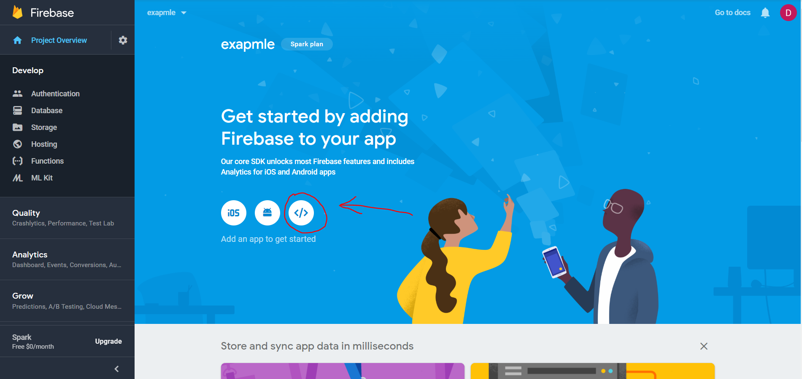
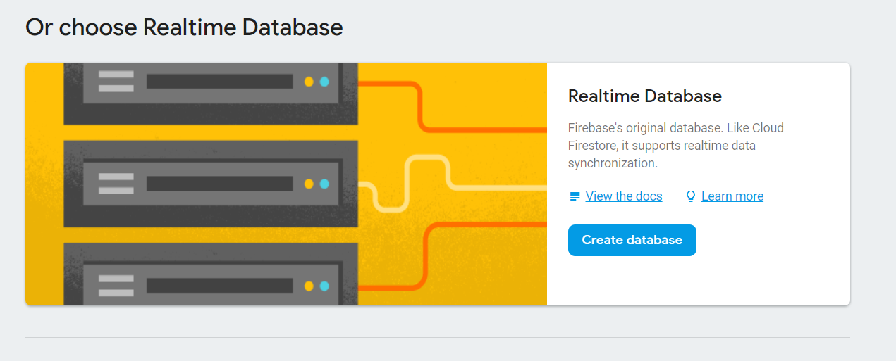
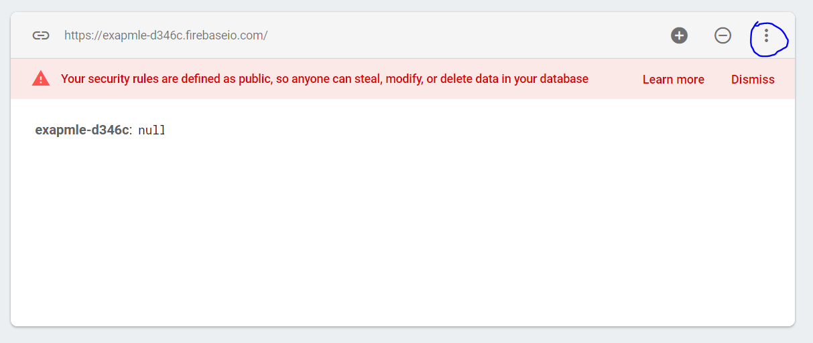
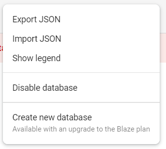

# firebase-Todo

## Purpose
This was all about calling json data asynchronously and saving modular selections to an array/object. This will later use a `POST` method when serving it to a database. I also implement SASS into this project.

## To View

**Note: This project requires you to have your own Google Firebase Account**

1. Clone repository to local machine.
1. run the following command in your termial to download webpage dependencies: ```npm install```
1. Open `apiKeys.json.example`
    * In Firebase, create a project
    * Select the 'webpage' app 
    * Match each key in the config variable to the keys available in `apiKeys.json.example`
    * Input the value of each key
    * Rename the file `apiKeys.json`
1. You will need to create a realtime database in Firebase and start in test mode 
1. Import the `toDo.json` file into the database for seed data.  

1. run the following command in your terminal to initiate the app: ```npm start```
This should automatically open a new tab in your default browser and run the web app, which pulls data from the Firebase app you have created.

## Notes

This uses SASS for styling. The only major note about it's use is that there is no special funcitonality. In other words, this could have been coded in a large css file. Future projects should see a heavier implementation of scss variables, nesting, etc.